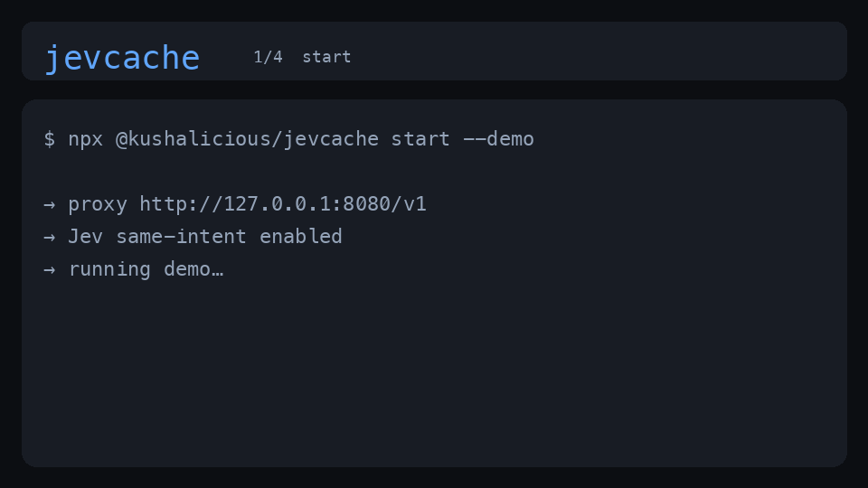

# jevcache

[](https://www.npmjs.com/package/@kushalicious/jevcache)
[](https://www.npmjs.com/package/@kushalicious/jevcache)
[](https://github.com/kushals256/jevcache/pkgs/container/jevcache)
[](./LICENSE)

**Routers pick a model. jevcache decides whether to call one.**

A local OpenAI-compatible proxy. When your app asks the **same question in different words**, [TypeSafe Jev](https://typesafe.ai) can reuse the cached answer — so you skip another expensive chat call.

Not cosine similarity. Calibrated **same-intent** admits. If Jev errors, it **fails open** and still calls the model.

<p align="center">
  
</p>

```
call 1  "Explain mutexes simply please"     →  MISS   ~3.2s   (calls the model, stores answer)
call 2  "Please explain mutexes simply"     →  HIT    ~0.4s   (jev · same answer · saved $)
```

**Verified on a real app:** MISS `3244ms` → HIT (`jev`, intent `0.93`) `394ms`, same cached reply, est. saved `$0.000137`.

**Want to try it in your project?** → [paste the agent prompt](#easiest-path-paste-into-cursor-or-any-coding-agent) into a new Cursor chat (or run `npx` below).

Works with one script, one agent, or many — anything that speaks `/v1/chat/completions`.  
**No native SQLite compile** — uses Node’s built-in `node:sqlite` (Node ≥ 22.5).

---

## Easiest path: paste into Cursor (or any coding agent)

**Open a new agent chat → copy the whole block below → send.**  
The agent installs jevcache, wires `OPENAI_BASE_URL`, and proves **MISS → HIT**. Same prompt lives in [`AGENT_SETUP.md`](./AGENT_SETUP.md).

```text
You are setting up jevcache for me in this project.

Goal: run an OpenAI-compatible local proxy that caches chat completions when TypeSafe Jev judges "same intent", so repeated/paraphrased LLM calls cost less while I build.

Repo: https://github.com/kushals256/jevcache
npm: npx @kushalicious/jevcache@latest

Do ALL of the following without asking me to run terminal commands myself (you run them):

1. Check Node.js >= 22.5. If missing, tell me how to install it in one step for my OS.
2. Prefer the easiest install that works:
   a) Try: npx --yes @kushalicious/jevcache@latest doctor
      (fallback: npx --yes github:kushals256/jevcache doctor)
   b) If that fails, use Docker with ghcr.io/kushals256/jevcache:latest on port 8080
   c) Or clone into ../jevcache, npm install, npm run build.
3. Ask me ONCE for an OpenRouter API key (https://openrouter.ai/keys) if OPENROUTER_API_KEY is not set. Save to .env (never commit; ensure .gitignore has .env).
4. Run: npx @kushalicious/jevcache init  (writes OPENAI_BASE_URL into .env)
5. Start jevcache in the background on http://127.0.0.1:8080 and verify GET /healthz.
6. Wire THIS app so OpenAI-compatible clients use baseURL "http://127.0.0.1:8080/v1".
7. Add SETUP_JEVCACHE.md with start command, baseURL, and /stats link.
8. Optionally add .cursor/rules/jevcache.mdc so future agents keep that baseURL.
9. Prove it: paraphrased prompts → expect MISS then HIT. Show X-Jevcache headers or /stats.

Do not commit secrets. If install fails, try the next method (npx → docker → clone).

When done, tell me: start command, baseURL, key location, whether MISS → HIT passed, stats URL.
```

You’ll need an [OpenRouter](https://openrouter.ai/keys) key when the agent asks (for real Jev hits). Prefer this path if you’re already in Cursor / Claude Code / Windsurf.

---

## Or try it yourself in 30 seconds

```bash
npx @kushalicious/jevcache@latest start --demo
```

You’ll get a key prompt, wiring snippets (`OPENAI_BASE_URL` in `.env`), a live **MISS → HIT**, and green HIT lines in the terminal.

| | |
| --- | --- |
| **Proxy** | `http://127.0.0.1:8080/v1` |
| **Stats** | [http://127.0.0.1:8080/stats](http://127.0.0.1:8080/stats) · `jevcache open` / `jevcache status` |
| **npm** | [`@kushalicious/jevcache`](https://www.npmjs.com/package/@kushalicious/jevcache) |
| **Docker** | `ghcr.io/kushals256/jevcache:latest` |
| **Agent setup** | [`AGENT_SETUP.md`](./AGENT_SETUP.md) ← paste into a new chat |

**No OpenRouter key?** still try the flow:

```bash
MOCK_JEV=1 MOCK_UPSTREAM=1 npx @kushalicious/jevcache@latest start --demo
```

Without a key, the proxy runs in **exact-only mode** (paraphrases miss; identical prompts can hit). You’ll see a clear banner on start.

---

## Wire your app (one line change)

```bash
npx @kushalicious/jevcache init   # writes OPENAI_BASE_URL=http://127.0.0.1:8080/v1 into ./.env
```

Or set it yourself:

```js
import OpenAI from "openai";

const client = new OpenAI({
  apiKey: process.env.OPENROUTER_API_KEY,
  baseURL: "http://127.0.0.1:8080/v1", // ← was OpenAI / OpenRouter directly
});
```

```bash
export OPENAI_BASE_URL="http://127.0.0.1:8080/v1"
export OPENAI_API_KEY="$OPENROUTER_API_KEY"
```

See [`examples/openai_sdk.mjs`](./examples/openai_sdk.mjs).

---

## How it works

```text
request → policy (bypass stream/tools/…)
       → exact SHA cache?
       → recent candidates + Jev same_intent?
       → HIT  → return cached answer
       → MISS → call upstream → store → return
```

**Why is the first call always a MISS?** The cache is empty for that question — pay once, store the answer, then paraphrases can HIT.

---

## CLI

```bash
npx @kushalicious/jevcache init              # .env + OPENAI_BASE_URL
npx @kushalicious/jevcache doctor            # check keys
npx @kushalicious/jevcache doctor --live     # + /healthz, Jev, upstream
npx @kushalicious/jevcache start             # run proxy
npx @kushalicious/jevcache start --demo      # live MISS → HIT
npx @kushalicious/jevcache status            # running? hit rate / $ saved
npx @kushalicious/jevcache open              # open /stats
npx @kushalicious/jevcache help
```

On a TTY: **green HIT**, **dim MISS**. Ctrl+C prints a session summary.

| Env | Meaning |
| --- | --- |
| `JEVCACHE_DEMO=1` | Same as `--demo` |
| `JEVCACHE_QUIET=1` | Hide per-request lines |
| `JEVCACHE_NO_COLOR=1` | Disable colors |

### Docker

```bash
docker run --rm -p 8080:8080 \
  -e OPENROUTER_API_KEY=$OPENROUTER_API_KEY \
  -e UPSTREAM_API_KEY=$OPENROUTER_API_KEY \
  ghcr.io/kushals256/jevcache:latest
```

Or: `docker compose up`.

---

## FAQ

**Do I need OpenRouter?**  
For **Jev same-intent** hits: yes. For **exact-only**: any OpenAI-compatible upstream. For a **keyless demo**: `MOCK_JEV=1 MOCK_UPSTREAM=1`.

**Multi-agent only?** No — any repeating/paraphrasing chat client benefits.

**Native build tools?** No longer required for SQLite (Node built-in). Requires **Node ≥ 22.5**.

**Secrets in this repo?** No. Local `.env` only (gitignored).

**Privacy:** Cache on disk under `DATA_DIR`. Semantic tier sends truncated, redacted text to OpenRouter for Jev. See [`SECURITY.md`](./SECURITY.md).

---

## From source

```bash
git clone https://github.com/kushals256/jevcache
cd jevcache && npm install && npm start
```

## Eval

```bash
npm run eval
LIVE=1 OPENROUTER_API_KEY=... npm run eval
```

See [`results/eval.json`](./results/eval.json).

## Not in v0

Streaming cache HITs, tool-call caching, hosted multi-tenant SaaS, auto model routing.

## Links

- [Agent setup prompt](./AGENT_SETUP.md) · [Changelog](./CHANGELOG.md) · [Contributing](./CONTRIBUTING.md) · [Security](./SECURITY.md)
- [npm](https://www.npmjs.com/package/@kushalicious/jevcache) · [Releases](https://github.com/kushals256/jevcache/releases)

## License

MIT

<!-- Social preview: upload docs/og.png in GitHub Settings → General → Social preview -->
